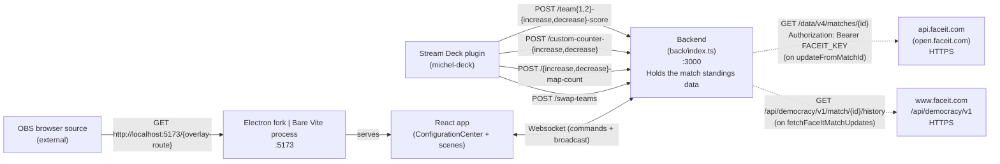
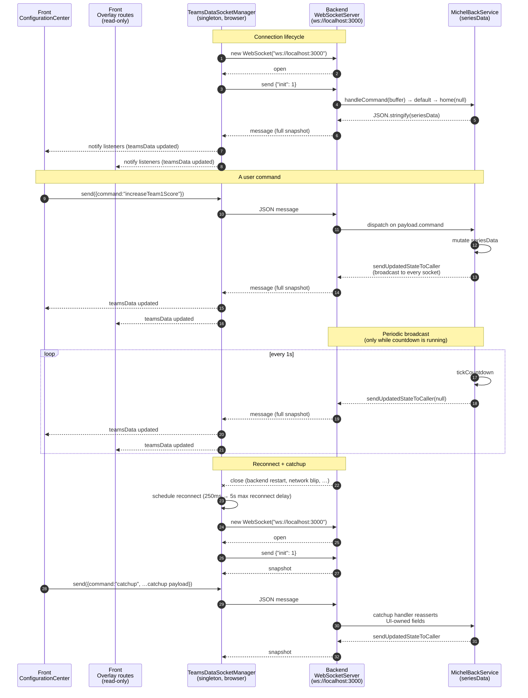

# Architecture

This document describes the runtime architecture of MICHEL: what the components are, which are mandatory vs. optional, and how they talk to each other over HTTP and WebSocket.

## Table of contents

- [Foreword](#foreword)
- [Components](#components)
  - [Core (essential) components](#core-essential-components)
  - [Optional components](#optional-components)
- [Interactions](#interactions)
  - [Process model](#process-model)
  - [Ports and URLs](#ports-and-urls)
  - [HTTP surface](#http-surface)
  - [WebSocket surface](#websocket-surface)
  - [Configuration sources](#configuration-sources)
  - [Cross-component glue and assumptions](#cross-component-glue-and-assumptions)
- [HTTP data flow](#http-data-flow)
- [WebSocket data flow](#websocket-data-flow)

## Foreword
Summary partially AI generated, then re-read to remove as many uncertainties as possible, as well as some bloat that did not help : it should now be relatively exhaustive

## Components

The repository contains four workspaces plus a thin orchestration layer at the root.

### Core (essential) components

#### `back/` — backend / state authority

- Entry point: `back/index.ts` (compiled to `dist/back/index.js`).
- Boots an Express HTTP server on port `3000` (hardcoded).
- Attaches a `ws` `WebSocketServer({ noServer: true })` to the same HTTP server via the `upgrade` event (`back/index.ts`).
- Owns the canonical `seriesData` state object inside the singleton `MichelBackService` (`back/handlers/home.ts`). All mutations go through this service; every mutation ends by broadcasting the full state to every WS client (`sendUpdatedStateToCaller`, `back/handlers/home.ts`).
- Talks to two external HTTP services (only when a FaceIt match id is involved):
  - `https://open.faceit.com/data/v4/matches/{matchId}` with `Authorization: Bearer <FACEIT_KEY>` (`back/handlers/home.ts`).
  - `https://www.faceit.com/api/democracy/v1/match/{matchId}/history` (`back/handlers/home.ts`).

Without `back/` the system has no state and no fan-out: the front would sit on its `DEFAULT_STATE` literal and the Stream Deck plugin's HTTP calls would all fail silently.

#### `front/client-app/` — operator UI and overlays

- React + Vite SPA (`front/client-app/vite.config.js`), built to `dist/front/`.
- Single SPA with one route per overlay plus a Configuration Center, declared in `front/client-app/src/App.jsx`.
- Makes **zero HTTP requests** to the back. A grep over `front/client-app/src` for `fetch(`, `axios`, `XMLHttpRequest` returned no matches. All back communication is via WebSocket.
- Connects to `ws://localhost:3000` through a singleton manager `TeamsDataSocketManager` (`front/client-app/src/teamsDataSocket.ts`) with auto-reconnect (`front/client-app/src/teamsDataSocket.ts`).
- The WS URL is hardcoded at `front/client-app/src/config.js` (`WEBSOCKET_URL = "ws://localhost:3000"`).
- Only `ConfigurationCenter.jsx` *sends* commands; the overlay routes are read-only consumers of the shared socket (`front/client-app/src/ConfigurationCenter.jsx`, vs. `ConnectionBadge.jsx`, `GameScene.jsx`, etc.).

Without the front there is no UI: nothing renders the state for OBS, and no one can issue most commands (the Stream Deck plugin only covers four of them).

### Optional components

#### `electron-app/` — desktop wrapper

- Entry: `electron-app/main.js`.
- **Forks two child processes** on `app.whenReady()` (`electron-app/main.js`):
  1. The backend: `fork('../dist/back/index', [], { env: { ..., FACEIT_KEY } })` (`electron-app/main.js`).
  2. A static file server: `fork('electron-app/frontServer.js', [], { env: { ..., FRONT_SERVER_PORT } })` (`electron-app/main.js`).
- Creates a `BrowserWindow` and loads the front from `file://`, not via the static server: `win.loadFile(path.join(process.env.DIST, 'index.html'))` where `DIST = ../dist/front/` (`electron-app/main.js`). If `VITE_DEV_SERVER_URL` is set it falls back to `win.loadURL(...)` for development (`electron-app/main.js`).
- Owns persistent configuration at `<userData>/config.json` (`electron-app/config.js`).
- Provides a Settings window for editing the FaceIt API key (`electron-app/main.js`, `electron-app/settings.html`). On save, it restarts the backend fork (`electron-app/main.js`).

Optional because the root `package.json` ships an alternate `start` script that runs back + front via `concurrently` without Electron (`package.json`). For a turnkey desktop install Electron is the natural choice; for browser-source-only setups (overlays consumed by OBS over HTTP) it is not strictly required.

The static `frontServer.js` (`electron-app/frontServer.js`) serves `dist/front/` on `FRONT_SERVER_PORT` (default `5173`). It is used to present the same components to the user than the bare front-app, just encased in a all-in-one desktop app that does not need any setup besides double-clicking on the executable binary. Typically, it can be started to expose the endpoints OBS "Browser views" will point to.

#### `stream-deck-plugin/michel-deck/` — Elgato Stream Deck plugin

- TypeScript plugin built via Rollup to `com.hoshin-casts.michel-deck.sdPlugin/bin/plugin.js` (`stream-deck-plugin/michel-deck/rollup.config.mjs`).
- Four actions, each performing a single hardcoded HTTP POST to `http://localhost:3000`:
  - `IncrementCounter` → `/team{1|2}-{increase|decrease}-score` (`src/actions/increment-counter.ts`).
  - `IncrementCustomCounter` → `/custom-counter-{increase|decrease}` (`src/actions/increment-custom-counter.ts`).
  - `MapCounter` → `/{increase|decrease}-map-count` (`src/actions/map-counter.ts`).
  - `Toggle` → `/swap-teams` (`src/actions/toggle.ts`).
- Does **not** open a WebSocket to the back. Its only WS connection is to the Stream Deck host via the Elgato SDK (`streamDeck.connect()`, `src/plugin.ts`). The plugin therefore receives no state updates from the back — it is fire-and-forget.
- Errors are caught and silently dropped (every action's `.catch` is empty).

Optional because the plugin's four actions are a strict subset of what the Configuration Center already exposes over WebSocket. Removing the plugin removes hardware buttons; nothing else breaks.

## Interactions

### Process model

When launched via Electron (the most common runtime), three Node processes run concurrently:

1. **Electron main process** — `electron-app/main.js`.
2. **Backend fork** — `dist/back/index.js`, spawned by `fork()` from the Electron main process.
3. **Front static server fork** — `electron-app/frontServer.js`, spawned by `fork()` from the Electron main process.

Plus, in the *same* Electron process, a renderer process owns the BrowserWindow that loads `dist/front/index.html` from disk (`electron-app/main.js`).

When launched via the root `npm run start` (no Electron) there are two processes: the backend (`node ./dist/back/index.js`) and the Vite dev server (`npm run dev` in `front/client-app/`), run concurrently via `concurrently` (`package.json`).

### Ports and URLs

| Surface | Port | Where it is set | Read from env? |
|---|---|---|---|
| Backend HTTP + WebSocket | `3000` | Hardcoded at `back/index.ts`. | No. |
| Front static server (Electron only) | `5173` (default) | `electron-app/frontServer.js:4`, value from `FRONT_SERVER_PORT` env, fallback `5173`. The env is set by the Electron main process from `config.ports.frontServer` (`electron-app/main.js`, default in `electron-app/config.js`). | Yes (in the fork). |
| Vite dev server (standalone only) | Vite default (`5173`) | `front/client-app/package.json` (`vite` command). Not configured anywhere in this repo. | n/a |
| Front → back WebSocket URL | `ws://localhost:3000` | Hardcoded at `front/client-app/src/config.js`. | No. |
| Stream Deck plugin → back base URL | `http://localhost:3000` | Hardcoded in each `src/actions/*.ts`. | No. |

`config.ports.backServer` is present in the Electron config schema (`electron-app/config.js`) but **is never read by any consumer**. Changing it has no effect on the back's hardcoded `3000`. Verified by grepping the repo: `backServer` appears only in `config.js` and the README.

### HTTP surface

All HTTP routes are defined in `back/index.ts`. Each handler delegates to a `MichelBackService` method, which mutates state and broadcasts the new state to every connected WebSocket (full mechanism in [WebSocket surface](#websocket-surface)).

| Method | Path | Source | Effect |
|---|---|---|---|
| GET  | `/` | `back/index.ts` | Returns current `seriesData` JSON. |
| POST | `/team1-increase-score` | `back/index.ts` | Increment team 1 score by 1. |
| POST | `/team1-decrease-score` | `back/index.ts` | Decrement team 1 score by 1. |
| POST | `/team2-increase-score` | `back/index.ts` | Increment team 2 score by 1. |
| POST | `/team2-decrease-score` | `back/index.ts` | Decrement team 2 score by 1. |
| POST | `/custom-counter-increase` | `back/index.ts` | Increment the custom counter. |
| POST | `/custom-counter-decrease` | `back/index.ts` | Decrement the custom counter. |
| POST | `/increase-map-count` | `back/index.ts` | Advance map count (may trigger a FaceIt fetch — see below). |
| POST | `/decrease-map-count` | `back/index.ts` | Decrement map count. |
| POST | `/swap-teams` | `back/index.ts` | Swap team 1 and team 2. |

Two outbound HTTP integrations from the back (both to FaceIt):

- `https://open.faceit.com/data/v4/matches/{matchId}` — fired by the WS command `updateFromMatchId` (`back/handlers/home.ts`).
- `https://www.faceit.com/api/democracy/v1/match/{matchId}/history` — fired by the WS command `fetchFaceItMatchUpdates` (`back/handlers/home.ts`).

The only HTTP client in the repo (other than the back's FaceIt calls) is the Stream Deck plugin. The front has none.

### WebSocket surface

The back's WebSocket server (`back/index.ts`) speaks a JSON-over-text protocol.

**Incoming envelope (client → back).** Every message is `JSON.parse`d (`back/handlers/home.ts`) and dispatched on `payload.command` (`back/handlers/home.ts`). Known commands:

`increaseTeam1Score`, `decreaseTeam1Score`, `increaseTeam2Score`, `decreaseTeam2Score`, `updateTeam1Name`, `updateTeam2Name`, `swapTeams`, `increaseMapCount`, `decreaseMapCount`, `updateMapFormat`, `updateTeam1Logo`, `updateTeam2Logo`, `updateTournamentLogo`, `toggleOptionalLogoDisplay`, `updateFromMatchId`, `fetchFaceItMatchUpdates`, `increaseCustomCounter`, `decreaseCustomCounter`, `team1UpdateBan`, `team2UpdateBan`, `setMapCount`, `catchup`, `countdownSet`, `countdownStart`, `countdownPause`, `countdownResume`, `countdownReset`, `countdownSetColor`.

Anything else falls through to `michelBackService.home(null)` (`back/handlers/home.ts`), which simply rebroadcasts the current state. The front exploits this on connect by sending `{ init: 1 }` to receive an initial snapshot (`front/client-app/src/teamsDataSocket.ts`).

**Outgoing envelope (back → clients).** A single message format: `JSON.stringify(this.seriesData)` — the entire state, every time (`back/handlers/home.ts`). Triggered by every HTTP route, every WS command, and the countdown 1 s tick `tickCountdown` (`back/handlers/home.ts`).

**Clients of the back's WS:** only the front. Verified by grepping for `WebSocket(` / `ws://localhost:3000` — only `front/client-app/src/teamsDataSocket.ts` and the hardcoded URL in `front/client-app/src/config.js` match. The Stream Deck plugin does not open a socket to the back.

### Configuration sources

| File | Consumer | Purpose                                                                                                                                                                                                                                                                                                                                                                                                                  |
|---|---|--------------------------------------------------------------------------------------------------------------------------------------------------------------------------------------------------------------------------------------------------------------------------------------------------------------------------------------------------------------------------------------------------------------------------|
| `<userData>/config.json` (e.g. `%APPDATA%\michelectron\config.json`) | Electron main process (`electron-app/config.js`) | Persistent settings. Today only `secrets.faceItAPIKey` (forwarded to the back as `FACEIT_KEY` env, `electron-app/main.js`) and `ports.frontServer` (forwarded as `FRONT_SERVER_PORT`, `electron-app/main.js`) are actually wired. Other fields (`ports.backServer`, `debug`, `preferences.openDevTools`, `overlays`) are declared but **not read by any consumer in the current code** — noted in `electron-app/README.md`. |
| `back/config.json` | Backend (`back/handlers/home.ts`) | Initial `seriesData` snapshot when the back starts. Read via `fs.readFileSync('./back/config.json')`. If the file is missing the back falls back to `DEFAULT_SERIES_DATA` (`back/handlers/home.ts`).                                                                                                                                                                |
| `back/config.template.json` | Documentation only. Not read at runtime. | —                                                                                                                                                                                                                                                                                                                                                                                                                        |
| `front/client-app/src/config.js` | Front bundle | Compile-time constants including `WEBSOCKET_URL`.                                                                                                                                                                                                                                                                                                                                                                        |
| Root `package.json` `build` block | `electron-builder` (`package.json:32`–`package.json:67`) | Native installer configuration.                                                                                                                                                                                                                                                                                                                                                                                          |
| Stream Deck `manifest.json` | Stream Deck host | Plugin metadata; `CodePath: bin/plugin.js`.                                                                                                                                                                                                                                                                                                                                                                              |

> [Warning] About `back/config.json` : The way it is currently read means the working directory from which we start the back-end matters. I might come around and fix it at some point, but it is not very high on the list at the moment.

Env var bridges (Electron → forks): `FACEIT_KEY` (`electron-app/main.js` → `back/handlers/home.ts`), `FRONT_SERVER_PORT` (`electron-app/main.js` → `electron-app/frontServer.js`).

### Cross-component glue and assumptions

- **No shared types package.** The `SeriesData` shape lives in `back/handlers/home.ts`. The front re-declares a parallel `DEFAULT_STATE` literal at `front/client-app/src/config.js`. They drift independently.
- **No shared command vocabulary.** The set of `command` strings is defined implicitly by the switch in `back/handlers/home.ts`. The front uses these strings directly inside `ConfigurationCenter.jsx`. The Stream Deck plugin avoids the issue entirely by using HTTP routes (which carry the verb in their path).
- **Coordination is implicit.** Electron does not wait for the back's port to be listening before reloading the renderer — it only waits for the child process to spawn (`electron-app/main.js`). The front's auto-reconnect logic (`front/client-app/src/teamsDataSocket.ts`) absorbs the race.
- **The `catchup` command** is sent by the front after a reconnect to re-assert any local UI state that the back might not know about (`front/client-app/src/ConfigurationCenter.jsx`, handler at `back/handlers/home.ts`).

## HTTP data flow

The HTTP surface is split into two unrelated flows: the Stream Deck plugin posting commands to the back, and the back fetching FaceIt data on demand.

Notes:

- Dotted arrows to FaceIt are conditional (only when the corresponding WS command is received).

## WebSocket data flow

Only one WebSocket relationship exists in the system: front → back.

Note: 

`catchup payload` references the contents of the actual payload used by a client app to send "catchup data" to the back in the event it were to go offline for some reason. This typically includes : 
- FaceIt match ID
- Teams names, logos, scores
- Map number
- Tournament logo

All as seen in `ConfigurationCenter`'s `buildCatchupIntent` function

Key references:
- Front singleton manager + handlers: `front/client-app/src/teamsDataSocket.ts`.
- Back upgrade and connection wiring: `back/index.ts`.
- Back dispatch, broadcast & countdown tick broadcast: `back/handlers/home.ts`.
- Front catchup: `front/client-app/src/ConfigurationCenter.jsx`; back catchup handler: `back/handlers/home.ts`.
