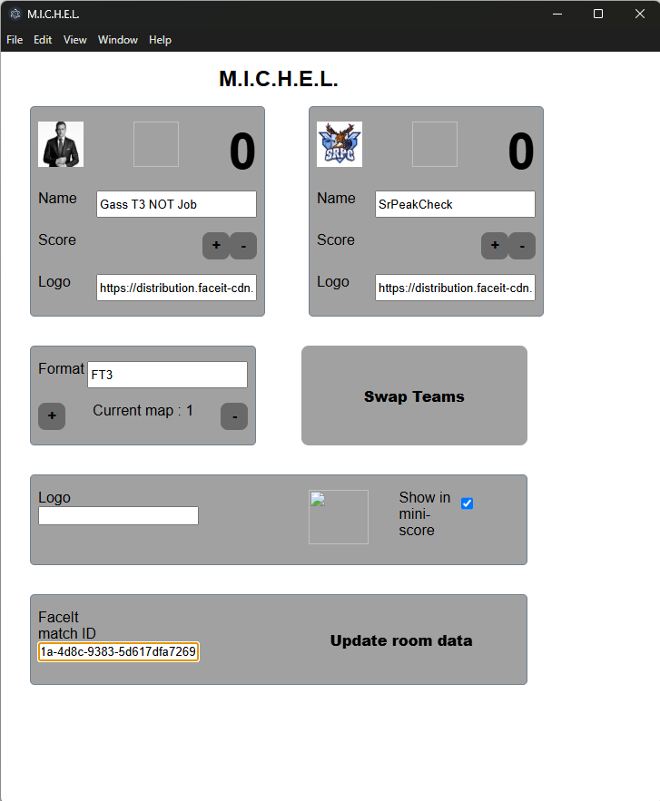
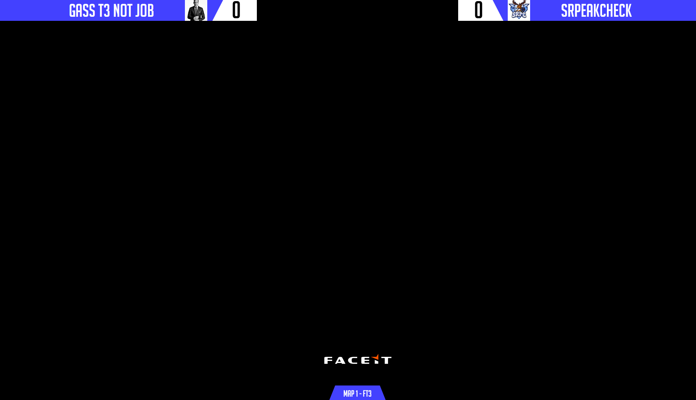
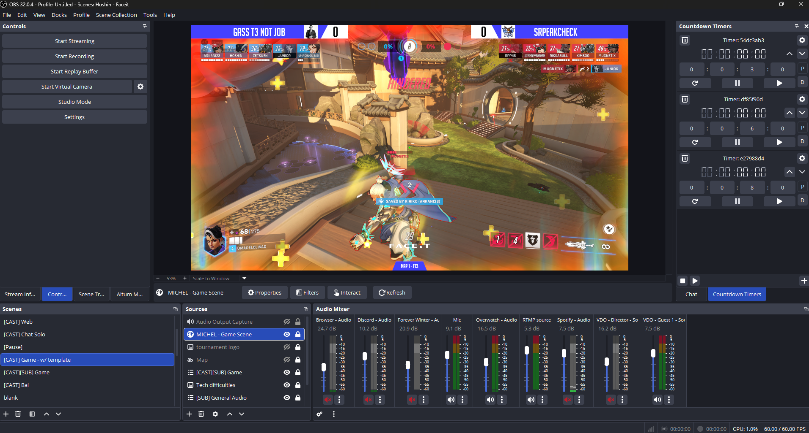
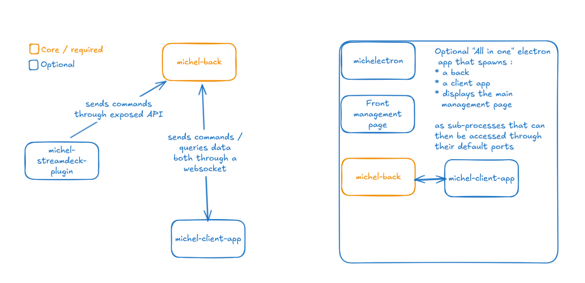

# M.I.C.H.E.L.
**M**anagement **I**nterface for **C**asting **H**osts **E**njoying **L**ightness — a personal toolbox to run a solo e-sports cast (Overwatch-flavored) without alt-tabbing yourself into oblivion.

[](https://creativecommons.org/licenses/by-nc/4.0/)
[](https://nodejs.org/)

## Table of contents

- [Foreword / Caution](#foreword--caution)
- [Requirements](#requirements)
- [Project layout](#project-layout)
- [Description and purpose](#description-and-purpose)
- [Features](#features)
- [Getting started](#getting-started)
- [OBS web-source URLs](#obs-web-source-urls)
- [General architecture](#general-architecture)
- [Configuration files](#configuration-files)
- [Scripts cheat sheet](#scripts-cheat-sheet)
  - [Releasing](#releasing)
- [Building the Electron app](#building-the-electron-app)
- [Stream Deck plugin](#stream-deck-plugin)
- [Known issues & caveats](#known-issues--caveats)
- [License](#license)

## Foreword / Caution

> **THIS IS NOT PRODUCTION READY** — I cannot stress that enough.
>
> This is still very much a personal tool, with all the issues that come with it. I am building it as I go, following the requirements of the moment, but I feel that it can start being a tool to play around with for others also.
> This still has plenty of kinks, but it works fine for me at this point. I still want to add features, upgrade the code, harden it, do a better job at testing everything... but it displays the information I need and reacts correctly, without crashing, during my casts :')
>
> **THIS IS NOT PRODUCTION READY** — ...one more for the road.
>
> If you're interested in this but cannot quite figure out how to get it running: I'm interested and will do my best to help (providing we can manage time).

## Requirements

| Required | Why |
|---|---|
| **Node.js 20+** | All sub-projects target Node 20 (`@tsconfig/node20`, GitHub Actions matrix). |
| **npm 10+** | Ships with Node 20. |
| **Git** | Cloning the repo, tagging releases. |

Optional, depending on what you do:

| Optional | When you need it |
|---|---|
| `rpm` CLI on the host | Building Linux RPM packages locally (Ubuntu: `sudo apt install rpm`). |
| Wine | Building Windows installers from Linux/macOS hosts. |
| Elgato Stream Deck software | Installing/running the Stream Deck plugin. |
| FaceIt developer API key | FaceIt integration (lobby auto-fill, bans). Sign up at [developers.faceit.com](https://developers.faceit.com). |

## Project layout

```
.
├── back/                         # Express + WebSocket API (TypeScript)
├── front/client-app/             # React + Vite UI (scenes + configuration center)
├── electron-app/                 # Electron host that bundles back + front
├── stream-deck-plugin/
│   └── michel-deck/              # Elgato Stream Deck plugin (TypeScript + Rollup)
├── documentation/                # Screenshots used in this README
├── faceit-stuff/                 # FaceIt-related notes / scratch
├── gimp-sources/                 # Source files for image assets
└── .github/workflows/            # CI / release pipeline
```

### Tech stack at a glance

| Sub-project | Stack |
|---|---|
| `back` | Node 20, TypeScript, Express 5, `ws`, Pino, Jest |
| `front/client-app` | React 19, Vite 6, React Router 7, Ant Design 6, ESLint + Prettier + Husky |
| `electron-app` | Electron 36, child-process `fork` for the backend, tiny Express static server for the front |
| `stream-deck-plugin/michel-deck` | TypeScript, Rollup, `@elgato/streamdeck`, packaged with `@elgato/cli` |

## Description and purpose

MICHEL is a personal tool, first and foremost, aimed at helping someone who'd like to get into casting e-sports matches but feels like there's way too much alt-tabbing going around. It probably won't fit every need, but I'll be glad to accept PRs if it comes to this :)

The idea is to set the match up beforehand and then pilot everything through a device like a Stream Deck (or anything that can send calls to the main app).

## Features

### Keep the core data of a match between 2 teams and broadcast updates live

The configuration center / management interface lets you manually input:
- Names / logos of the two teams playing
- Match format / round number
- Team scores (updatable live)
- Tournament logo
- Utilities:
  - swap the order in which teams will be displayed
  - _(FaceIt only)_ load room data — updates team names & logos from a lobby ID
  - _(FaceIt only)_ refresh room data


> Yes, it's ugly af — I needed features before tying a bow on that one. We'll get there... eventually ^^'

### Query the FaceIt API for advanced match data

Currently focused on the **Overwatch 2** integration of FaceIt. It lets you:
- Auto-fill team names and logos using the lobby ID
- Display the bans for the current map of a match
- Refresh bans on demand

### Ready-to-use templated HTML pages for AV mixers (OBS et al.)

`michel-client-app` exposes calibrated pages (of the 1920x1080 variety for fullscreen pages) designed to be added as [OBS](https://obsproject.com/) browser sources.



Each page connects to the WebSocket exposed by `michel-back`, so whatever updates the back receives is fanned out to every connected page and updates immediately.



### All-in-one Electron app

The Electron app is a single executable that bundles both `michel-back` and `michel-client-app`. You can't tweak everything from there, but starting it spins up:
- The management interface inside the Electron window
- `michel-back` (HTTP + WebSocket on port 3000)
- A static Express server hosting `michel-client-app` on port 5173

…which means the default scene templates are immediately available as OBS browser sources.

### Stream Deck control surface

The provided plugin lets you:
- Increase/decrease the score of either team
- Increase/decrease the round / map count
- Increase/decrease a custom counter
- Swap the positions of the teams (which side gets displayed left vs right)

It's still rough around the edges, so it's not published on the Marketplace. Installation is manual (see [Stream Deck plugin](#stream-deck-plugin)).

## Getting started

### Easiest: grab a release

Once a `v*` tag is pushed, GitHub Actions builds and attaches platform binaries to a [GitHub Release](../../releases). Pick the one matching your OS:

| OS | Artifact |
|---|---|
| Windows x64 | `MICHELectron Setup <version>.exe` (NSIS installer) |
| Linux x64 | `.AppImage`, `.deb`, or `.rpm` |
| macOS (Intel) | `MICHELectron-<version>-mac.zip` |
| macOS (Apple Silicon) | `MICHELectron-<version>-arm64-mac.zip` |

macOS builds are **unsigned**. The first launch will be blocked by Gatekeeper — right-click → Open, or run `xattr -d com.apple.quarantine <path>` to unquarantine.

### From source — development mode

```bash
# 1. Install dependencies (root + every sub-project)
npm ci
npm --prefix back ci
npm --prefix front/client-app ci
npm --prefix electron-app ci
npm --prefix stream-deck-plugin/michel-deck ci   # only needed to rebuild the SD plugin

# 2. Create back/config.json from the template (see "Configuration files" below)
cp back/config.template.json back/config.json

# 3. Run back + front concurrently (builds back/front first, then starts both)
npm run start
```

Then open:
- Management interface: <http://localhost:5173/configuration-center>
- Any of the scene URLs (see [OBS web-source URLs](#obs-web-source-urls))

### From source — Electron bundle

```bash
npm run build:all        # cleans, builds back + front + SD plugin + electron app
npm run start:electron   # launches the packaged Electron app against the built outputs
```

For producing distributable installers per OS, see [Building the Electron app](#building-the-electron-app).

## OBS web-source URLs

With the back and the front running (either via `npm run start` or via the Electron app), the following routes are served by `michel-client-app`:

| URL | What it shows |
|---|---|
| `http://localhost:5173/configuration-center` | Management interface (same screen that lives inside the Electron window) |
| `http://localhost:5173/game-scene` | Main in-game scene composite |
| `http://localhost:5173/score-scene` | Both teams' scores with logos and names |
| `http://localhost:5173/solo-score-scene` | A single-side score variant |
| `http://localhost:5173/team-1-score` | Team 1 score panel alone |
| `http://localhost:5173/team-2-score` | Team 2 score panel alone |
| `http://localhost:5173/team-1-ban` | Team 1 ban display |
| `http://localhost:5173/team-2-ban` | Team 2 ban display |
| `http://localhost:5173/current-map` | Current map indicator |
| `http://localhost:5173/tournament-logo` | Tournament logo block |

Unknown routes fall back to the configuration center.

## General architecture



In short:

- **`michel-back`** is the heart: a small Express server on port `3000` that owns the match state, exposes a REST surface to mutate it (e.g. `POST /team1-increase-score`, `POST /swap-teams`), and broadcasts every change over a WebSocket to all connected clients. The live entry point is `back/index.ts`. (`back/wrapper.ts` is legacy and no longer used; it predates `index.ts` and is kept around for reference.)
- **`michel-client-app`** is a React/Vite front-end that consumes that WebSocket. It exposes the management UI (`/configuration-center`) and a set of dedicated routes meant to be embedded as OBS browser sources (`/game-scene`, `/score-scene`, etc.).
- **`michelectron`** is the all-in-one host: it `fork`s `michel-back`, runs a small static Express server on `5173` to serve the built front, and opens a Chromium window pointed at `/configuration-center`.
- **`michel-streamdeck-plugin`** is a remote control: each button fires an HTTP `POST` against `http://localhost:3000` (currently hard-coded). The backend then mutates state and broadcasts to every connected scene at once.

Why split it up? Mostly because not everyone has the same taste as I do when it comes to interfaces for a stream. Building dedicated front-ends or remotes is much easier when the back is a stable, language-agnostic HTTP+WS service.

## Configuration files

Two JSON config files matter. **Neither is committed** — `back/config.json` is explicitly git-ignored and `electron-app/config.json` is expected to be a local-only file too. Use the shapes below as templates.

### `back/config.json`

Mirror of `back/config.template.json` — copy it on first setup. Holds the bootstrap state of the match.

```jsonc
{
  "seriesData": {
    "team1":   { "name": "", "score": 0, "logo": "<URL>" },
    "team2":   { "name": "", "score": 0, "logo": "<URL>" },
    "display": {
      "right": "team1",
      "left":  "team2",
      "mapCount": 1,
      "mapFormat": "FT3",
      "tournamentLogo": "<URL>",
      "optionalLogoDisplay": true
    },
    "faceIt": {
      "matchId": "",
      "tournamentLogo": "<URL>",
      "apiKey": "<FaceIt developer API key>"
    },
    "standings": {}
  },
  "link": ""
}
```

Alternatively, the FaceIt key can be provided via the `FACEIT_KEY` environment variable instead of being baked into the file.

### `electron-app/config.json`

Consumed by the Electron host. Expected shape:

```jsonc
{
  "ports": {
    "frontServer": 5173,
    "backServer":  3000
  },
  "debug": false,
  "secrets": {
    "faceItAPIKey": "<your FaceIt developer API key>"
  },
  "preferences": {
    "openDevTools": false
  },
  "overlays": {}
}
```

The app can start without a configuration file, it will just rely on defaults

## Scripts cheat sheet

All scripts below are run from the **repo root** unless noted.

### Run

| Script | What it does |
|---|---|
| `npm run start` | Builds back + front, then runs `start:back:build` and `start:front` concurrently. |
| `npm run start:electron` | Launches Electron against the built outputs (no rebuild). |
| `npm run start:back` | Runs `back`'s own `npm run start` (currently a placeholder — see note below). |
| `npm run start:back:build` | Runs the compiled backend: `node ./dist/back/index.js`. |
| `npm run start:front` | Runs the Vite dev server in `front/client-app`. |

> `back`'s own `npm run start` is currently a placeholder (`exit 1`). The supported way to run the backend in dev is `npm run start:back:build` (after `npm run build:back`) or `npm run start` at the root.

### Build

| Script | What it does |
|---|---|
| `npm run build:clean` | Removes `dist/` and `release-builds/`. |
| `npm run build:back` | Compiles `michel-back` to `dist/back/` (`tsc`). |
| `npm run build:front` | Builds `michel-client-app` to `dist/front/` (Vite). |
| `npm run build:streamdeck-plugin` | Builds and packages the Stream Deck plugin (Windows wrapper — see [Stream Deck plugin](#stream-deck-plugin) for non-Windows). |
| `npm run build:electron-app` | Runs `electron-builder` against the host OS. |
| `npm run build:electron-app:win` | Builds Windows x64 only. |
| `npm run build:electron-app:linux` | Builds Linux x64 only (AppImage + deb + rpm). |
| `npm run build:electron-app:mac` | Builds macOS x64 + arm64 (unsigned zips). |
| `npm run build:all` | End-to-end: clean → back → front → SD plugin → electron app. |

### Test

| Script | What it does |
|---|---|
| `npm test` (root) | Currently a no-op (`exit 1`). Tests live per-workspace. |
| `npm test` in `back/` | Runs Jest unit tests against the backend. |

### Releasing

Cutting a release is a two-step flow: **start** a release (bump the version on a dedicated branch) and **finish** it (tag the merged commit and trigger the CI build).

| Script | What it does |
|---|---|
| `npm run release:start -- <major\|minor\|patch>` | Creates `release/v<x.y.z>` off the latest `origin/main`, bumps the root `package.json` according to semver, commits as `Release v<x.y.z>`, and pushes the branch to `origin`. |
| `npm run release:finish` | Reads the version from `origin/main:package.json`, creates an annotated `v<x.y.z>` tag on that commit, and pushes the tag to `origin` — which fires the `Release build` GitHub Actions workflow. |

Both scripts live in `scripts/` and have no runtime dependencies beyond `git` and `npm` on PATH.

#### `npm run release:start -- <type>`

The `--` is required so npm forwards the bump type to the script (e.g. `npm run release:start -- patch`).

What it does, in order:

1. Validates the argument (must be exactly `major`, `minor`, or `patch`).
2. Refuses to run with a dirty working tree.
3. `git fetch origin main`.
4. Reads the version from `origin/main:package.json` (the canonical baseline — not your local branch) and computes the next semver.
5. Aborts if `release/v<x.y.z>` already exists locally or on `origin`.
6. `git checkout -b release/v<x.y.z> origin/main`.
7. Bumps the version with `npm version <type> --no-git-tag-version` (rewrites `package.json` and `package-lock.json` if present, no tag, no commit).
8. Commits the bump as `Release v<x.y.z>`.
9. Pushes the branch with upstream tracking (`git push -u origin release/v<x.y.z>`).

It deliberately does **not** create a git tag — tagging is what triggers the release workflow, and you'll want that to happen against the *merged* commit on `main`, not against the bump commit on the release branch.

After the script finishes, the normal flow is:

1. Open a PR from `release/v<x.y.z>` into `main`, review, and merge it.
2. Run `npm run release:finish` (next section).

#### `npm run release:finish`

Takes no arguments. The version it tags comes from `origin/main:package.json`, so it's always in sync with what was actually merged.

What it does, in order:

1. Refuses to run with a dirty working tree.
2. `git fetch --tags origin main`.
3. Reads the version from `origin/main:package.json` and validates it's plain `MAJOR.MINOR.PATCH`.
4. Resolves `origin/main` to a specific commit SHA (so it tags an explicit commit, not a symbolic ref that could move).
5. Aborts if `v<x.y.z>` already exists locally or on `origin`.
6. Creates an annotated tag: `git tag -a v<x.y.z> -m "Release v<x.y.z>" <sha>`.
7. Pushes only the tag: `git push origin v<x.y.z>`.

That push matches the `tags: v*` trigger in `.github/workflows/release.yml`, which kicks off the cross-platform build matrix and (on success) creates the GitHub Release with all installers attached.

#### Summary flow

```
# 1. From any branch, on a clean tree:
npm run release:start -- patch        # e.g. 1.2.3 -> 1.2.4 on release/v1.2.4

# 2. Open the PR (release/v1.2.4 -> main) on GitHub, review, merge.

# 3. Back on your machine, on a clean tree:
npm run release:finish                # tags v1.2.4 on origin/main, pushes it.

# 4. GitHub Actions builds Windows/Linux/macOS artifacts and publishes a Release.
```

## Building the Electron app

The "All in one" executable (`michelectron`) is packaged using [`electron-builder`](https://www.electron.build/). Its configuration lives in the `build` block of the root `package.json`, alongside the scripts described below.

### Prerequisites
- Node.js 20+
- `npm ci` in the root, then in each workspace: `back/`, `front/client-app/`, `electron-app/`, and `stream-deck-plugin/michel-deck/` (the last one is only needed for the Windows build).
- The backend and frontend must be built before packaging — the electron app embeds their `dist/` outputs.
- For Linux RPM packages built locally, the `rpm` CLI must be available on the host.

### Build scripts (root `package.json`)

Run these from the repository root.

| Script | What it does | Output (in `dist/electron-release-build/`) |
|---|---|---|
| `npm run build:clean` | Removes `dist/` and `release-builds/`. | — |
| `npm run build:back` | Compiles `michel-back` into `dist/back/`. | — |
| `npm run build:front` | Builds `michel-client-app` into `dist/front/`. | — |
| `npm run build:streamdeck-plugin` | Packages the Stream Deck plugin (Windows only — uses `build-and-package:win`). | `dist/streamdeck-plugin/com.hoshin-casts.michel-deck.streamDeckPlugin` |
| `npm run build:electron-app` | Runs `electron-builder` for the host OS using its default target list. | Native installer(s) for the current OS. |
| `npm run build:electron-app:win` | Builds Windows x64 only. | `MICHELectron Setup <version>.exe` (NSIS installer) + `.blockmap` + `latest.yml`. |
| `npm run build:electron-app:linux` | Builds Linux x64 only. | `MICHELectron-<version>.AppImage`, `michelectron_<version>_amd64.deb`, `michelectron-<version>.x86_64.rpm`. |
| `npm run build:electron-app:mac` | Builds macOS x64 + arm64 (unsigned). | `MICHELectron-<version>-mac.zip` and `MICHELectron-<version>-arm64-mac.zip`. |
| `npm run build:all` | Runs `clean` → `back` → `front` → `streamdeck-plugin` → `electron-app` end to end. | All of the above for the host OS. |

Notes:
- macOS builds are produced **unsigned** (`identity: null`, `CSC_IDENTITY_AUTO_DISCOVERY=false`). Distributing them outside personal use will require an Apple Developer ID and notarization.
- The `icon` is currently `electron-app/images/logo_56.png`. It is intentionally low-res for now; `electron-builder` will emit warnings about the icon size in Linux/Mac builds but the build still succeeds.

### Building all three platforms from one machine

`electron-builder` can cross-compile, but **macOS targets can only be produced on a Mac** (without that you'd get an unsigned zip at best, and `.dmg`/signing won't work at all). For Windows/Linux/macOS coverage without juggling VMs locally, the project relies on the GitHub Actions matrix described below.

### GitHub Actions release workflow

The workflow lives at `.github/workflows/release.yml`.

#### Triggers
- **Push of a `v*` tag** (e.g. `git tag v1.2.0 && git push --tags`) — runs the full matrix and publishes a GitHub Release.
- **Manual `workflow_dispatch`** — runs the build matrix and uploads artifacts, but does **not** create a Release.

#### Build matrix
Three parallel jobs, one per host OS:

| Job | Runner | Script invoked | Stream Deck plugin built? | Artifact name |
|---|---|---|---|---|
| Windows build | `windows-latest` | `build:electron-app:win` | yes | `michel-windows` |
| Linux build | `ubuntu-latest` | `build:electron-app:linux` | no | `michel-linux` |
| macOS build | `macos-latest` | `build:electron-app:mac` | no | `michel-mac` |

Each job:
1. Checks out the repo.
2. Sets up Node 20 with npm cache.
3. On Linux, installs `rpm` for RPM packaging.
4. Runs `npm ci` for the root and each workspace (`back/`, `front/client-app/`, `electron-app/`, and `stream-deck-plugin/michel-deck/` only on Windows).
5. Runs `build:clean`, `build:back`, `build:front`.
6. Runs `build:streamdeck-plugin` (Windows only).
7. Runs the platform-specific `build:electron-app:*` script.
8. Uploads the produced installers/packages as a workflow artifact (`.exe`, `.AppImage`, `.deb`, `.rpm`, `.zip`, `.dmg`, plus `.blockmap` and `latest*.yml` when present).

#### Release job
After all three matrix jobs succeed, and **only if the trigger was a `v*` tag**, a final `release` job:
1. Downloads every artifact uploaded by the build matrix.
2. Uses [`softprops/action-gh-release@v2`](https://github.com/softprops/action-gh-release) to create a public GitHub Release named after the tag, with auto-generated release notes, and attaches every artifact (Win installer, Linux AppImage/deb/rpm, Mac zips for both x64 and arm64) to it.

#### Cutting a new release in practice
Use the helper scripts documented in [Releasing](#releasing):

```bash
npm run release:start -- patch   # or `minor` / `major`
# review & merge the auto-created release/v<x.y.z> PR into main, then:
npm run release:finish
```

Then watch the workflow in the GitHub Actions tab; once it finishes, the Release will be available with all platform binaries attached.

## Stream Deck plugin

### Install (no-build path)

A pre-packaged plugin file will be made available in new releases artifacts, alongside the desktop app

With the Elgato Stream Deck software running, double-click the file — it'll prompt to install/replace the plugin. The actions then become available in the plugin sidebar.

### Available actions

| Action | What it does (HTTP call against `michel-back`) |
|---|---|
| Team 1 score +/− | `POST /team1-increase-score` / `POST /team1-decrease-score` |
| Team 2 score +/− | `POST /team2-increase-score` / `POST /team2-decrease-score` |
| Map count +/− | `POST /increase-map-count` / `POST /decrease-map-count` |
| Custom counter +/− | `POST /custom-counter-increase` / `POST /custom-counter-decrease` |
| Swap teams | `POST /swap-teams` |

The backend URL is currently hard-coded to `http://localhost:3000` in the action sources — see [Known issues & caveats](#known-issues--caveats).

### Rebuild from source

From the repo root:

```bash
npm run build:streamdeck-plugin     # Windows wrapper
```

Or, from inside `stream-deck-plugin/michel-deck/`:

```bash
npm run build-and-package:win       # Windows
npm run build-and-package:bash      # macOS / Linux
```

Both variants produce a fresh `.streamDeckPlugin` archive under `dist/streamdeck-plugin/` versioned from `package.json`.

The plugin's source lives in `stream-deck-plugin/michel-deck/src/`; `npm run watch` (inside that folder) rebuilds on change and restarts the plugin in the Stream Deck app.

## Known issues & caveats

- **Orphan child processes.** Depending on how the Electron window is closed (window close, Alt+F4, "Quit" menu), the `michel-back` and front-static `fork`ed processes may survive. Kill them manually if you hit it. Tracked in `TODO.md`.
- **`localhost`-only.** Both servers bind to `localhost`; remote access from another machine on the LAN isn't supported today.
- **Hard-coded backend URL in the Stream Deck plugin.** Every action targets `http://localhost:3000`. If you customize ports in `electron-app/config.json`, the plugin won't follow.
- **Unsigned macOS builds.** First launch is blocked by Gatekeeper; right-click → Open or run `xattr -d com.apple.quarantine <path>`.
- **Low-resolution app icon.** `electron-app/images/logo_56.png` is below `electron-builder`'s recommended size; you'll see warnings on Linux/Mac builds. Builds still succeed.
- **Front-end favicon missing.** Cosmetic, tracked in `TODO.md`.
- **`back/wrapper.ts` is legacy.** Not on the live code path; `back/index.ts` is the entry point compiled by `npm run build:back`.

## License

This work is licensed under the [CC-BY-NC](https://creativecommons.org/licenses/by-nc/4.0/).
